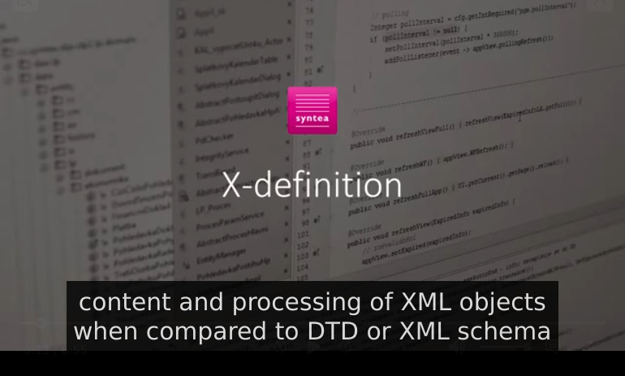

# X-definition


## About

**X-definition** is a technology designed to describe the **validation, processing and construction** of data
in **XML** format (as well as **JSON, YAML** and similar).

X-definition is a technology designed by **Syntea software group a.s.** for professional description, validation,
processing and creation of the structure of XML, JSON, YAML, INI and CSV documents. It allows the user
not only to **define the structure of XML documents**, but also to specifically describe their
**processing and construction**. X-definition also allows you to define and use code in **external user methods**.

Homepage: <http://www.xdef.org>

This project is implemented for the platform **Java 1.8+**
(additional note: up to the version 41.0.4 for the platform Java 1.6+).


## License

This project is **Open Source Software (OSS)** licensed under
[Apache 2.0 license](http://www.apache.org/licenses/LICENSE-2.0).


## Illustrative examples

You can try the following examples online at: <http://xdef.syntea.cz/tutorial/examples/validate.html>.

Example 1: **Essential concepts**
<table><tr style="vertical-align: top;"><td>
Let´s have the following XML data:

```xml
<Employee
  FirstName = "Andrew"
  LastName  = "Aardvark"
  EnterDate = "1996-03-12"
  Salary    = "21700"
>
  <Address
    Street = "Broadway"
    Number = "255"
    Town   = "Beverly Hills"
    State  = "CA"
    Zip    = "90210"
  />
  <Competence>electrician</Competence>
  <Competence>carpenter</Competence>
</Employee>


```

</td><td>
This is complete X-definition describing the XML data on the left:

```xml
<xd:def
  xmlns:xd = "http://www.xdef.org/xdef/4.2"
  xd:root  = "Employee"
>
  <Employee
    FirstName = "required string()"
    LastName  = "required string()"
    EnterDate = "required date()"
    Salary    = "optional decimal()"
  >
    <Address
      Street = "required string()"
      Number = "required int()"
      Town   = "required string()"
      State  = "required string()"
      Zip    = "required int()"
    />
    <Competence xd:script = "occurs 1..5">
      required string()
    </Competence>
  </Employee>
</xd:def>
```

</td></tr></table>

You can try it on the ["Playground-online"](http://www.xdef.org/example/media/xdef-web/intro-01-EssentialConcepts.html).

Example 2: **References**
<table><tr style="vertical-align: top;"><td>
XML data:

```xml
<Family>
  <Father
    GivenName  = "John"
    FamilyName = "Smith"
    PersonalID = "7107130345"
    Salary     = "18800"
  />
  <Mother
    GivenName  = "Jane"
    FamilyName = "Smith"
    PersonalID = "7653220029"
    Salary     = "19400"
  />
  <Son
    GivenName  = "John"
    FamilyName = "Smith"
    PersonalID = "9211090121"
  />
  <Daughter
    GivenName  = "Jane"
    FamilyName = "Smith"
    PersonalID = "9655270067"
  />
  <Residence
    Street     = "Small"
    Number     = "5"
    Town       = "Big"
    Zip        = "12300"
  />
</Family>
```

</td><td>
X-definition describing the XML data:

```xml
<xd:def
  xmlns:xd = "http://www.xdef.org/xdef/4.2"
  xd:root  = "Family"
>
  <Family>
    <Father    xd:script = "occurs 0..1; ref Person"  />
    <Mother    xd:script = "occurs 1..1; ref Person"  />
    <Son       xd:script = "occurs 0..*; ref Person"  />
    <Daughter  xd:script = "occurs 0..*; ref Person " />
    <Residence xd:script = "occurs 1;    ref Address" />
  </Family>
  
  <Person
    GivenName  = "string()" 
    FamilyName = "string()" 
    PersonalID = "long()"
    Salary     = "optional int()"
  />
  <Address
    Street = "string()"
    Number = "int()"
    Town   = "string()"
    Zip    = "int()"
  />
</xd:def>


```

</td></tr></table>

You can try it on the ["Playground-online"](http://www.xdef.org/example/media/xdef-web/intro-02-References.html).


## Annotation

X‑definition is designed for description and processing of data in the XML format and also JSON, YAML and similar.

X-definition is an open-source tool that describes the structure and properties of data values in an XML document.
In addition, X-definition allows you to describe the processing and construction of XML objects. X-definition can
thus replace existing technologies commonly used for XML validation — namely Data Type Definition (DTD),
XML Schema (XSD), Schematron, and XML Stylesheet Language Transformations (XSLT).

X-definition allows you to combine XML document validation with data processing (by describing the actions
assigned to each event when processing XML objects). Compared to technologies based on DTD and XML schema,
the advantage of X-definition is (not only) higher readability and easier maintenance. X-definition was designed to
handle XML data sets of virtually unlimited size beyond the size of working memory.

An important feature of X-definition is the maximum respect for the structure of the described data. The form of
an X-definition is an XML document with a structure similar to the XML data being described. This allows a quick
and intuitive description of the XML data and its processing.

The properties of XML items (and the events that can occur during the process) are described by the X-script
language. In most cases, it is sufficient to replace the values described in the XML data model with the X-script
language in the X-definition. You can also incrementally add the required data processing actions to the X-script.
X-definition technology also allows you to generate source code for classes representing XML elements described
by an X-definition in Java. Such a class is called an X-component. Instances of XML data can be used in the form of
X components (similar to JAXB technology).

Starting with X-definition version 4.2, it is possible to validate and process data in JSON and YAML, Properties,
Windows INI, and CSV (comma-separated values) formats in addition to XML. JSON data structure models are
described by xd:json or xd:ini elements.

The X-definition also allows language localization of the tag names of the described XML data. Different language
versions can be described by elements in the xd:lexicon object.


## Documentation and online playground

For the **complete documentation** see the directory [xdef/src/documentation](/xdef/src/documentation).

You can try your X-definition examples and experiments at the following **"Playground-online"**:
  * web-page "Playground-online": <https://www.xdef.org/playground/>


# Media

Articles, lectures, presentations, videos:
  * Syntea/X-definition:
    <b>Short video tutorial</b>:
    <a href="https://www.youtube.com/watch?v=DgwtzLTPVvY">
        
    </a>

    * <li><div>
        XML Prague 2022:
        </div><div>
        V. Trojan, T. Šmíd:
        <a href="media/XMLPrague2022-X-definition-presentation.pdf">
            <b>X-definition 4.2</b>
        </a> (pdf)
        </div><div>
        link to the conference session:
        <a href="https://www.xmlprague.cz/day2-2022/#xdef">annotation</a>
        and video recording:
        </div><div>
        <a href="https://www.youtube.com/watch?v=8m02mXQp07E&list=PLQpqh98e9RgV8HrbmYWpLzYNSUSa3_Smb&index=11" target="_">
            
        </a>
        </div>
    </li>
    <li><div>
        dzone.com (2022-01):
        </div><div>
        <a href='https://dzone.com/articles/extracting-data-from-very-large-xml-files-with-x-d'>
            <b>Extracting Data From Very Large XML Files</b>
        </a> (www)
        </div>
    </li>
    <li><div>
        sourceforge.net (2021-04):
        </div><div>
        <a href='https://sourceforge.net/p/x-definition-beginner-xml/wiki/Home/'>
            <b>X-definition Beginner</b>
        </a> (www)
        </div>
    </li>
    <li><div>
        XML Prague 2020:
        </div><div>
        V. Trojan, T. Šmíd:
        <a href="media/XMLPrague2020-X-definition-presentation.pdf">
            <b>X-definition 3.1&rarr;4.0</b>
        </a> (pdf)
        </div><div>
        link to the conference session:
        <a href="https://www.xmlprague.cz/day3-2020/#xdef">annotation</a>
        and video recording:
        </div><div>
        <a href="https://www.youtube.com/watch?v=NcmTyV59AG8&list=PLQpqh98e9RgURPOd2Y6Md-WZ1_MpAqFK8&index=16" target="_">
            
        </a>
        </div>
    </li>
    <li><div>
        CTU/FIT-Informatics Evening (2018-11):
        </div><div>
        J. Kamenický, V. Trojan:
        <a href="media/CVUT-FIT-InformatickyVecer-2018-11-X-definice(91594).PPTX">
            <b>X-definition — data processing and transformation</b>
        </a> (pptx)
        </div><div>
        link to video recording:
        </div><div>
        <a href="https://www.youtube.com/watch?v=Miyvdqqgo54" target="_">
            
        </a>
        </div>
    </li>
    <li><div>
        XML Prague 2017:
        </div><div>
        V. Trojan, J. Kocman:
        <a href="media/XMLPrague2017-X-definition-presentation.pdf">
            <b>X-definition 2.0&rarr;3.1</b>
        </a> (pdf)
        </div><div>
        link to the conference session:
        <a href="https://www.xmlprague.cz/day3-2017/#xdef">annotation</a>
        and video recording:
        </div><div>
        <a href="https://www.youtube.com/watch?v=jNN0XTWZVMU&list=PLQpqh98e9RgUcEmbXmI6RolisQaIRw9dm&index=11" target="_">
            
        </a>
        </div>
    </li>
    <li><div>
        XML Prague 2009:
        </div><div>
        V. Trojan, J.Měska:
        <a href="media/XMLPrague2009-X-definition-presentation.ppt">
            <b>How the dog and cat cooked a cake</b>
        </a> (ppt)
        </div><div>
        link to the conference session:
        <a href="https://archive.xmlprague.cz/2009/sessions.html#xdefinition">annotation</a>
        and video recording:
        </div><div>
        <a href="https://www.youtube.com/watch?v=-IKPO_0E6iw&list=PLE616DA47460D46DA&index=11" target="_">
            
        </a>
        </div>
    </li>
    <li><div>
        XML Prague 2007:
        </div><div>
        V. Trojan, J. Kamenický, J. Měska:
        <a href="media/XMLPrague2007-X-definition-presentation.pdf">
            <b>Why All of Humanity Does Not Speak Esperanto</b>
        </a> (pdf)
        </div>
    </li>
    <li><div>
        XML Prague 2006:
        </div><div>
        V. Trojan: <b>X-definition</b>
        </div><div>
        link to the conference session:
        <a href="https://archive.xmlprague.cz/2006/sessions.html#xdef">annotation</a>
        </div>
    </li>
    <li><div>
        XML Prague 2005:
        </div><div>
        V. Trojan:
        <a href="media/XMLPrague2005-X-definition-presentation.ppt">
            <b>X-definition</b>
        </a> (ppt)
        </div><div>
        link to the conference session:
        <a href="https://archive.xmlprague.cz/2005/sessions.html#trojan">annotation</a>
        </div>
    </li>
</ul>


# Usage in other projects

## Check and download available versions

Links:
  * **published release versions** from the **Central Maven Repository**:
    * <https://central.sonatype.com/artifact/org.xdef/xdef/versions>
  * published **snapshot** versions from the Central Maven **Snapshot** Repository:
    * <https://central.sonatype.com/repository/maven-snapshots/>
      (SNAPSHOT www-browsing may be unavailable yet)
  * **information** about **release versions**:
    * [xdef/changelog.md](/xdef/changelog.md)
  * **download** using **maven system** directly:
    * [xdef-download-maven.sh](/administration/script-aux/xdef-download-maven.sh)

## Version package content

File assets in a version package:
  * _xdef-{version}.jar_            - the java-library X-definition
  * _xdef-{version}-userdoc.zip_    - complete user documentation and tutorial examples
  * _xdef-{version}-javadoc.jar_    - html-documentation of java source code generated from the java source code
  * _xdef-{version}-sources.jar_    - origin java source code
  * _xdef-{version}-src.zip_        - java source code insertable directly into your source code,
                                      very similar to _xdef-{version}-sources.jar_
  * _xdef-{version}.pom_            - maven metadata of the package

## Usage in your maven project

Configure your file pom.xml:
  * add the following `dependency` on a **release version** in the **Central Maven Repository**:

    ```xml
    <dependencies>
        …
        <dependency>
            <groupId>org.xdef</groupId>
            <artifactId>xdef</artifactId>
            <version>[release version]</version>
        </dependency>
    <dependencies>
    ```
  * or add the following `dependency` on a **snapshot** (or also release) **version**
    in the Central Maven **Snapshot** Repository (it's necessary to add the following `repository`):

    ```xml
    <dependencies>
        …
        <dependency>
            <groupId>org.xdef</groupId>
            <artifactId>xdef</artifactId>
            <version>[snapshot (or also release) version]</version>
        </dependency>
    </dependencies>
    …
    <repositories>
        …
        <repository>
            <id>central-snapshot</id>
            <url>https://central.sonatype.com/repository/maven-snapshots</url>
            <releases><enabled>false</enabled></releases>
            <snapshots><enabled>true</enabled></snapshots>
        </repository>
    </repositories>
    ```


# Building this project

Source code at GitHub:
  * link to the last stable version (to the branch "master"): <https://github.com/Syntea/xdef>

Prerequisities:
  * download project X-definition, e.g. from GitHub
    * for example git-command: `git clone git@github.com:Syntea/xdef.git`
    * git-repo uses file system symbolic links. If it's not enabled in your git, it can be enabled by two git-commands
      (run from the git-project root directory) "git config set core.symlinks true", "git reset --hard".
      For example, on Linux OS it is enabled by default. For example, on Windows OS it is disabled by default and
      in addition, "Developer Mode" (Start > Settings > Update & Security > For developers > Developer Mode > On)
      must be enabled in the system settings beforehand
  * install _java_ (at least version 8)
  * install _maven_ (at least version 3.6)
  * configuration:
    * configure the maven-plugin _toolchains_
      (see <https://maven.apache.org/plugins/maven-toolchains-plugin/usage.html>):
      * configure the xml-file _~/.m2/toolchains.xml_ in the home directory
      * see the template-file [administration/configuration-templates/maven/toolchains.xml](administration/configuration-templates/maven/toolchains.xml)

Frequent building operations:
  * cleaning before any compiling, building, deploying, etc.:

    ```shell
    mvn clean
    ```
  * compile all java-resources, respectively all compilable resources:

    ```shell
    mvn compile
    ```
  * build the snapshot package:

    ```shell
    mvn package
    ```
  * build the snapshot package including documentation, javadoc, sources:

    ```shell
    mvn package -Pdoc
    ```
  * using the profile "skipTests", avoid junit-tests:

    ```shell
    mvn package -PskipTests
    ```
  * using the profile "testOnAllJvms", junit-tests will be run on all configured Java platforms, i.e.:
    * Java-8 (by default it is run in the module "xdef")
    * Java-11 (it is run in the module "xdef-test11")
    * Java-17 (it is run in the module "xdef-test17")
    * Java-21 (it is run in the module "xdef-test21")
    * Java-25 (it is run in the module "xdef-test25")

    ```shell
    mvn package -PtestOnAllJvms
    ```
  * build the release package:

    ```shell  
    mvn package -Prelease
    ```
  * build the release package including documentation, javadoc, sources:

    ```shell
    mvn package -Prelease,doc
    ```


## Deploying to the maven central repository

Prerequisities:
  * satisfy prerequisities for building
  * install the pgp-managing software GnuPG (<https://gnupg.org/>)
  * configuration:
    * unlocking the appropriate pgp-key to sign artifacts:
      * insert the appropriate key to the the pgp-manager
      * enter the pgp-key-password for the pgp-key:
        * during the package build by the user when prompted by the pgp-agent
        * or beforehand to the environment variable _MAVEN_GPG_PASSPHRASE_
          (see <https://maven.apache.org/plugins/maven-gpg-plugin/sign-mojo.html#passphraseEnvName>)
    * authentication to the central maven repository manager _central.sonatype.com_:
      (having id _"central"_ in the file [xdef/pom.xml](xdef/pom.xml))
      * configure the maven-configuration-file in the home directory _~/.m2/settings.xml_
      * see template-file [administration/configuration-templates/maven/settings.xml](administration/configuration-templates/maven/settings.xml)

Deploying:
  * build and deploy the X-definition snapshot package to the central maven snapshot repository 
    (immediate deploy without processes validation and publishing):

    ```shell
    mvn deploy -Pdoc,dm-central
    ```
  * build and deploy the X-definition release package to the central maven repository
    * you can watch processes uploading, validation and publishing in
      <https://central.sonatype.com/publishing/deployments> as logged in appropriate user
    * the central repository requires to sign (this is done by using the profile "sign") deploying release-artifacts
      (on the other hand, the repository doesn't require to sign deploying snapshot-artifacts)

    ```shell
    mvn deploy -Prelease,doc,dm-central,sign
    ```
